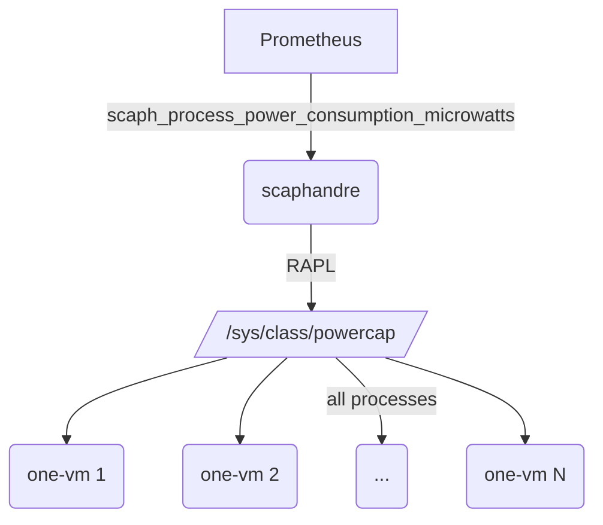

# OpenNebula Extensions

This repository holds a collection of extensions required by OpenNebula for the Implementation of the COGNIT project.

## Scaphandre Extension

Scaphandre is a metrology agent dedicated to electrical power consumption metrics. The goal of the project is to permit to any company or individual to measure the power consumption of its tech services and get this data in a convenient form, sending it through any monitoring or data analysis toolchain. Full details are available in the official repository of the project.

### How it works

A Scaphandre agent is installed on each Host, which is in charge of collecting the consumption metrics. Using the Prometheus exporter provided by Scaphandre, the metrics are exported and stored in Prometheus and can be later queried from Grafana. Scaphandre gathers an estimation for the power consumption for each process in a physical machine using the CPU RAPL extensions.


The use of this tool makes it possible to monitor the energy usage per host, VMs and containers. It also has different exporters, including one dedicated to Prometheus, which is the one used in the integration of this tool in OpenNebula.

### Requirements

- [A CPU with RAPL](https://hubblo-org.github.io/scaphandre-documentation/compatibility.html#checking-rapl-is-available-on-your-cpu)
- [A suitable kernel](https://hubblo-org.github.io/scaphandre-documentation/references/sensor-powercap_rapl.html#pre-requesites)
- The Scaphandre container must have access to the `/sys/class/powercap/` directory.
- A hypervisor node in [ENABLED state](https://docs.opennebula.io/6.8/management_and_operations/host_cluster_management/hosts.html#host-states) on the OpenNebula frontend

### Installation and usage

On the hypervisor host, run the `install.sh` script as `root` which will install scaphandre as a docker container and enable the required kernel modules.

```bash
./scaphandre/install.sh
```

On the hypervisor host, run the `generate_conf.sh`.

```bash
./scaphandre/generate_conf.sh
```

As output, you will find something similar to the following:

```yaml
- job_name: 'scaphandre'
  static_configs:
    - targets: ['my-kvm-host:8080']
      labels:
        host_id: 2
```

Append it to the file `/etc/one/prometheus/prometheus.yml` in the OpenNebula frontend host.

### Metrics

All the available metrics provided by Scaphandre can be found [here](https://hubblo-org.github.io/scaphandre-documentation/references/metrics.html).

In order to filter by OpenNebula VM or Host, you can use the labels `vmname=one-<id>` or `host_id=<id>`.

```bash
$ curl http://my-kvm-host:8080/metrics
# HELP scaph_process_power_consumption_microwatts Power consumption due to the process, measured on at the topology level, in microwatts
# TYPE scaph_process_power_consumption_microwatts gauge
scaph_process_power_consumption_microwatts{pid="4098269",exe="dnsmasq",cmdline="/usr/sbin/dnsmasq-x/run/dnsmasq/dnsmasq.pid-udnsmasq-7/etc/dnsmasq.d,.dpkg-dist,.dpkg-old,.dpkg-new--local-service--trust-anchor=.,20326,8,2,e06d44b80b8f1d39a95c0b0d7c65d08458e880409bbc683457104237c7f8ec8d"} 0
scaph_process_power_consumption_microwatts{exe="vhost-3604920",pid="3604946",cmdline=""} 3817
scaph_process_power_consumption_microwatts{exe="qemu-kvm-one",cmdline="/usr/bin/qemu-kvm-one-nameguest=one-524,...",exe="qemu-kvm-one",pid="3604920"} 125986
scaph_process_power_consumption_microwatts{exe="kvm-nx-lpage-recovery-3603755",cmdline="",pid="3603762"} 0
scaph_process_power_consumption_microwatts{exe="qemu-kvm-one",cmdline="/usr/bin/qemu-kvm-one-nameguest=one-523,...",exe="qemu-kvm-one",pid="3603755"} 129804
...
```

The metric `scaph_proces_power_consumption_microwatts` shows the amount of uW used for each process (where each VM is a KVM process).

## Hypervisor Nodes Geolocation

Every hypervisor host with a public IP address will have the GEOLOCATION attribute in the host template. This will hold a space separated list of coordinates in the form of `latitude,longitude` corresponding to the geographic location of the public IP address.


### How to use

- Copy the file `./geolocation/geo.rb` to `/usr/share/one/geo.rb` and give it execution permissions.
- Create a host state hook with the following template or the file `./geolocation/geo.hook`
  ```
  ARGUMENTS = $TEMPLATE
  NAME = host_geolocation
  TYPE = state
  COMMAND = /usr/share/one/geo.rb
  REMOTE = NO
  RESOURCE = HOST
  STATE = MONITORED
  ```

Every time a host enters the MONITORED state, which should be the end result of adding a host, the attribute `GEOLOCATION` should appear in the host template.

For example

```
oneadmin@opennebula-frontend:~$ onehost show 7 -j | jq .HOST.TEMPLATE.GEOLOCATION
"59.3294,18.0687" # Sweden Stockholm
```

## Prometheus

The opennebula-exporter has been enriched with two new vm metrics
- **opennebula_vm_ut_flavours**: The oneflow service_template ID used to create the Serverless Runtime with the [Provisioning Engine](https://github.com/SovereignEdgeEU-COGNIT/provisioning-engine). If the VM is not backing a Serverless Runtime, then it will be **-1**
- **opennebula_vm_power_consumption_uW**: The power consumption of a VM, provided that scaphandre is running on the host where the VM is deployed to.

The Serverless Runtime VMs might come with a Prometheus Exporter inside. This requires the VM Template used by the Service Template (FLAVOUR) to have the attribute `PROMETHEUS_EXPORTER=<PORT>`. When a VM is created with this attribute, the exporter will be automatically added as a target to scrape by the prometheus server shipped by the `opennebula-prometheus` package.

### How to use

Replace the following files

- `/usr/share/one/patch_datasources.rb` with `./prometheus/patch_datasources.rb`
- `/usr/lib/one/opennebula_exporter/opennebula_vm_collector.rb` with `./prometheus/vm_collector.rb`


Create a VM state hook using the file `./prometheus/vm.hook` or the template

```
NAME = prometheus_vm_discovery
TYPE = state
COMMAND = /usr/share/one/prometheus/patch_datasources.rb
ON = RUNNING
RESOURCE = VM
```

Every time a new VM is created, the hook will execute the script that will patch the targets to scrap by prometheus. Adding each VM with PROMETHEUS_EXPORTER.

To verify new targets

- check the prometheus configuration at `/etc/one/prometheus/prometheus.yml`
- check the targets being scrapped with `curl http://localhost:9090/api/v1/targets | jq .`

To verify new metrics issue ` curl localhost:9925/metrics`. An example follows:

```
# TYPE opennebula_vm_ut_flavours gauge
# HELP opennebula_vm_ut_flavours Flavours used to create the Serverless Runtime in the Provisioning Engine
opennebula_vm_ut_flavours{one_vm_id="1334"} 2470.0
opennebula_vm_ut_flavours{one_vm_id="1333"} 4.0
opennebula_vm_ut_flavours{one_vm_id="1329"} -1.0
opennebula_vm_ut_flavours{one_vm_id="1328"} 4.0
opennebula_vm_ut_flavours{one_vm_id="1324"} 4.0
opennebula_vm_ut_flavours{one_vm_id="1323"} -1.0
opennebula_vm_ut_flavours{one_vm_id="1320"} 2470.0
opennebula_vm_ut_flavours{one_vm_id="1317"} 2470.0
opennebula_vm_ut_flavours{one_vm_id="1311"} 2470.0
opennebula_vm_ut_flavours{one_vm_id="1307"} 5.0
opennebula_vm_ut_flavours{one_vm_id="1302"} 5.0
opennebula_vm_ut_flavours{one_vm_id="1301"} 5.0
# TYPE opennebula_vm_power_consumption_uW gauge
# HELP opennebula_vm_power_consumption_uW Scaphandre power usage by the VM in uW
opennebula_vm_power_consumption_uW{one_vm_id="1334"} 0.0
opennebula_vm_power_consumption_uW{one_vm_id="1333"} 0.0
opennebula_vm_power_consumption_uW{one_vm_id="1329"} 0.0
opennebula_vm_power_consumption_uW{one_vm_id="1328"} 0.0
opennebula_vm_power_consumption_uW{one_vm_id="1324"} 0.0
opennebula_vm_power_consumption_uW{one_vm_id="1323"} 0.0
opennebula_vm_power_consumption_uW{one_vm_id="1320"} 0.0
opennebula_vm_power_consumption_uW{one_vm_id="1317"} 0.0
opennebula_vm_power_consumption_uW{one_vm_id="1311"} 0.0
opennebula_vm_power_consumption_uW{one_vm_id="1307"} 0.0
opennebula_vm_power_consumption_uW{one_vm_id="1302"} 0.0
opennebula_vm_power_consumption_uW{one_vm_id="1301"} 0.0
```

