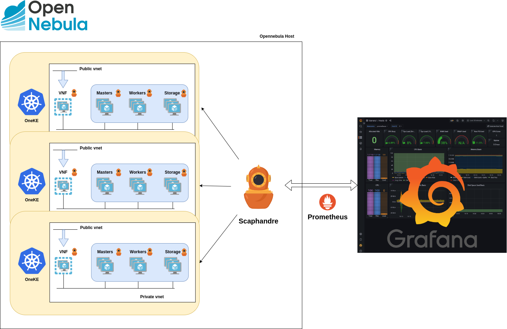

# Scaphandre Extension

Scaphandre is a metrology agent dedicated to electrical power consumption metrics. The goal of the project is to permit to any company or individual to measure the power consumption of its tech services and get this data in a convenient form, sending it through any monitoring or data analysis toolchain. Full details are available in the official repository of the project.

The use of this tool makes it possible to monitor the energy usage per host, VMs and containers. It also has different exporters, including one dedicated to Prometheus, which is the one used in the integration of this tool in OpenNebula.

## How it works

The following figure outlines the integration with OpenNebula:



A Scaphandre agent is installed on each Host, which is in charge of collecting the consumption metrics. Using the Prometheus exporter provided by Scaphandre, the metrics are exported and stored in Prometheus and can be later queried from Grafana.

## Requirements

1. Root access or user with sudo privileges to install the packages.

## Installation and usage

1. Run the `install.sh` script as `root` which will install the dependencies required by Scaphandre (docker) in case they are not installed. It will also enable the necessary kernel modules. This script will start the Scaphandre container.

```
sh ./install.sh
```

2. Once the previous script has been executed correctly, run the `generate_conf.sh`. This script will generate as output the configuration needed to add to the Prometheus configuration file.

```
sh ./generate_conf.sh
```

As output, you will find something similar to the following:

```
- job_name: 'scaphandre'
  static_configs:
    - targets: ['my-kvm-host:8080']
      labels:
        host_id: 2
```

This output shows the configuration to be added to Prometheus in order to collect Scapahndre data. The script will try to extract the Host ID from the OpenNebula monitor DB, but in case it is not found, it must be filled in by the user.

## Metrics

All the available metrics provided by Scaphandre can be found [here](https://hubblo-org.github.io/scaphandre-documentation/references/metrics.html).

In order to filter by OpenNebula VM or Host, you can use the labels `vmname=one-<id>` or `host_id=<id>`.
